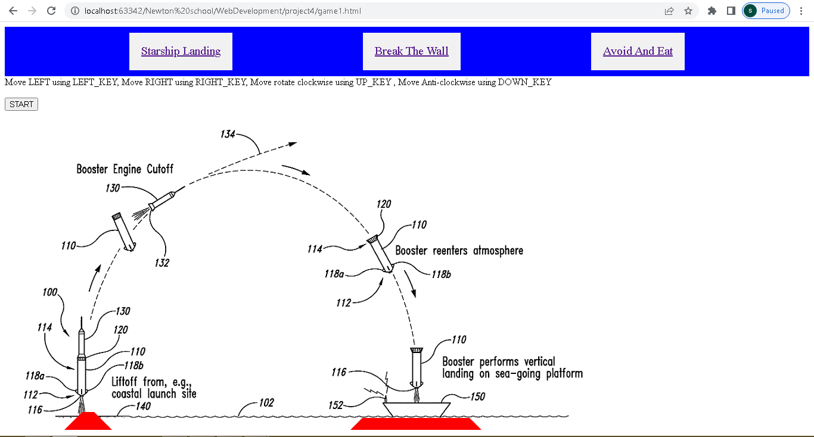
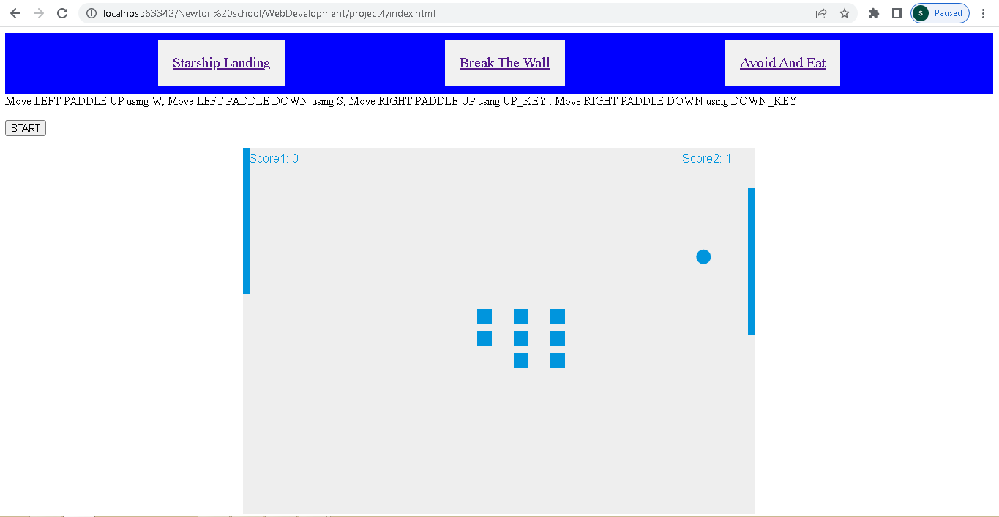
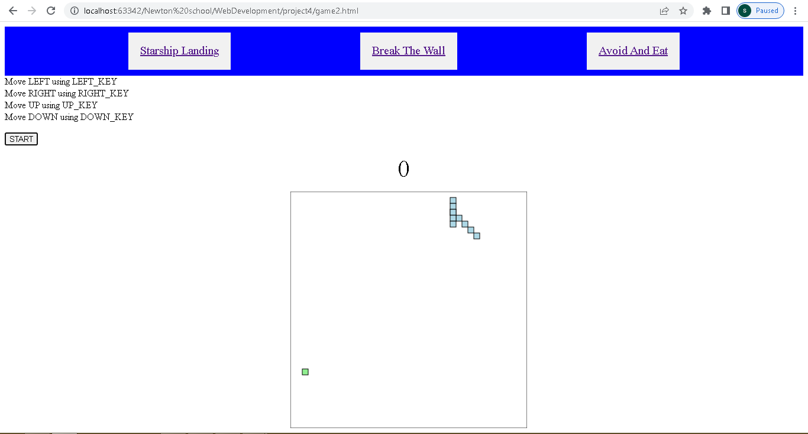

Hosted on : https://gamedevelopmentjs.netlify.app/index.html

1.Write the project description
In this project i have created 3 game named as Starship Landing,
Break The WAll and Avoid And Eat. Starship Landing simulate the landing of rocket to specified
location, it will flip after reaching to certain height and start falling to ground, now user task 
is to successfully land  the rocket using controls like moving right,left and rotation. 

2.WHY this project was chosen
I have choosen this project because there is lot to learn from this project related to JS.

3.HOW did you make the project.
In Starship Landing :
1. Set the background image for rocket landing.
2. Initialize the vairable such as move rate,turnrate,angle,speedx,speedy,
gravity,downgravity,gavityspeed,intervalId.
3. On button click game start, initially ship will  launch and start moving up,
as soon as it reaches to certain height it will flip by 90 degree.
4. event listener is created for keys such as right,down,left and up. up and down keys have rotation 
functionality and right/left will create drag for rocket.
5. position are updated and user has to successfully land the rocket
6. when the game is over we will clear the intervalId so that we can start a new game on start 
button click.

In Break the Wall :
1.Create the canvas and get the context.
2.Initialize the variable such as dx,dy,ballRadius,paddleHeight,paddleWidth for each 
paddle,uppressed/downpressed flag for each paddle,intervalID,score for each paddle,
brickRowCount,brickColumnCount,brickWidth,brickHeight,bricks.
3. set the setInterval to draw function. it will clear the canvas then will check the current position 
of ball is present inside canvas or not then the function drawBricks,drawBall,
drawPaddle,collisionDetection,drawScore. When user press the keys based on the flag of pressed key 
padle position is updated by dy. While ball position is updated based on dx,dy. when the ball is hit by 
paddle respective flag is set ,ball when hits the bricks ,score is updated for respective player.
4.Collision is detedted when ball hits the bricks.
4. when the game is over we will clear the intervalId so that we can start a new game on start
   button click.

In Avoid And Eat i worked as follows:
1.Create the canvas and get the context.
2.Initialize the variable such as dx,dy,intervalID,score,changing_directionmy,
food_x,food_y,dxmy,dxmy,snake(arrays of object)msnakemy(arrays of object).
3.Two snake will be created, one which will be running continuously inside the canvas, while 
the other snake movement will be controlled by user.
4.initially main function is called. Based on the present location of system snake we will check 
whether the snake is colliding with wall or not,based on the status we will update the dx,dy.
5.For collision detection we will check for common coordinate in snake and snakemy array.
6. set the setTimeout function to onMove which will call clear_board,drawFood,
   move_snake,drawSnake,move_snakemy,drawSnakemy.
7. when the game is over we will clear the intervalId so that we can start a new game on start
   button click.

4.WHAT features, technical things you had implemented.
I have used flexbox to assign navigation of link and arrangement of different tags using flexbox property.
such as justify-content:space-evenly,flex-direction:column etc.
we used canvas, performed rotation of object,Design and sucsessfull implementation of
Starship Landing,Break The WAll and Avoid And Eat.constraint checking and alert message.
